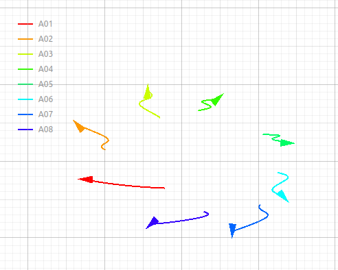

# SwarmSwIM: an Underwater Swarm Simulator 

<p align="center">
  
</p>

This is a Python3-based simulator designed for modeling multi-robot and swarm systems. It implements a simplified motion model, with an assumed level of low level control ("backseat") already baked in the simulated agents rather than calculating the full-body dynamics. This approach allows the simulator to efficiently handle a large number of agents simultaneously.


**Related repositories**
- [swarmswim examples](https://github.com/save-xx/swarmswim_examples)
- [swarmswimros](https://github.com/save-xx/swarmswimros)

## Features

- **Efficient Swarm Simulation**: Simulate numerous agents with simplified motion models.
- **Implicit backseat controller**: The "low level" controls and feedbacks governing the dynamics of the agents are baked in the simulation, and are customizable agent by agent.
- **Modular and Customizable**: Easily extendable for different agent types and behaviors. Plugin system to accomodate multiple Plugins such as sensors and utilities, to be activated on demand.
- **Ready to Use Plugins**: To add utilities such as currents, acoustic communication, map sensors, etc...
- **Scalability**: Optimized for handling multiple agents.
- **Basic Visualizations**: Includes simple tools for visualizing agent positions and swarm dynamics.

<p align="center">
<video src="https://github.com/user-attachments/assets/1fb1e474-fba9-489f-88ae-7a79dd36136a" autoplay loop muted width="600"></video>
</p>

<figure>
<p align="center">
  
</p>
  <figcaption align="center">SwarmSwIM visual 2D representation</figcaption>
</figure>

## Requirements

The following Python packages are required to run the simulator:

- **Core Functionality**: `numpy`, `scipy`
- **Visualization & Animation**: `pyqtgraph`, `PyQt5`, `imageio`
- **Data storing**: `openpyxl`, `pandas`

> Note: the pip installer will handle all the dependacy installations.

---
# Standard installation
For a generic installation, just run: 
```bash
pip install git+https://github.com/save-xx/SwarmSwIM.git
```

---
### Dev installation
If you which to be ablse to visualize and modify the source code, or contribute to it, then you will have to install iy as a developer. To do so:

Clone the repository in a Folder of your choice:
```bash
git clone https://github.com/save-xx/SwarmSwIM.git
```

Enter the folder that has been cloned
in the `SwarmSwIM` folder:  
```bash
cd SwarmSwIM/ # Go to download folder
```
  
Install SwarmSwIM as python pakage, `-e` indicates that is editable.
```bash
pip install -e .
```

The installation should conclude with:
```
Successfully built SwarmSwIM
Installing collected packages: SwarmSwIM
Successfully installed SwarmSwIM-x.x.x
```

It is recommented to use a python virtual envrioment, such as `venv`.

---
#### Uninstall

To Uninstall the package simply:
```bash
pip uninstall SwarmSwIM
```
> Note: Dependace installed with the package will not be automatically unistalled (`numpy`, etc..).


## Basic Usage: Using the Simulator as a Python Library
The simulator can be directlely be used as python library to set up your own simulator.
To Set you own simulation:

Create your simulation directory
```bash
mkdir mysim_ws && cd mysim_ws
```

Intialize the agent.xml and simulation.xml descriptors as well as a py script to run it.
You can use the inbuild command to initialize a new simulation:

```bash
SwarmSwIM create_new
```

or

```bash
python3 -m SwarmSwIM.utility.cli create_new
```

## Use Case Scenarios 
In the [swarmswim examples](https://github.com/save-xx/swarmswim_examples) are stored more examples, showcasing the different functionalities as well as full case scenarios and examples of uses of SwarmSwIM.

## ROS2 Implementation
This simulator is also avaiable for ROS2 implementation. The ROS2 impementation is designed as a stand-alone module based on this core. It will __not__ require the core installation, since it is already designed with the simulator locally in-build. For information on the installation and use please check-out the ros2 swarmswim repo at:  [swarmswimros](https://github.com/save-xx/swarmswimros)


## Wiki
For more details, check out the [Wiki](https://github.com/save-xx/SwarmSwIM/wiki).

## Cite
If you found this work useful, please cite us using the following:

```bibtex
@inproceedings{iacoponi2025h,
  title={SwarmSwIM: a simulator for underwater swarms of robots. In OCEANS 2025},
  author={Iacoponi, Saverio and Infanti, Andrea and El Hanbali, Mohammed and De Masi, Giulia and Renda, Federico},
  booktitle={OCEANS 2025, Brest},
  year={2025},
  organization={IEEE}
}
```